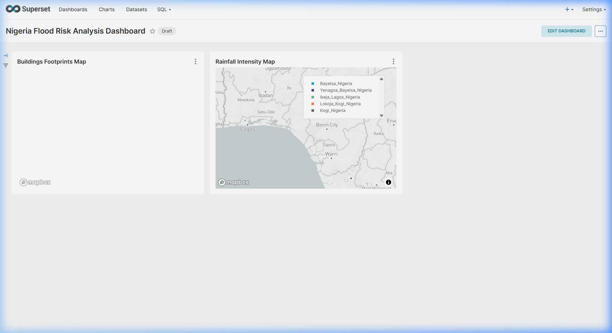

# Technical Development Report: Geospatial Data Pipeline for Urban Flood Risk Assessment

This report provides a comprehensive technical overview of the geospatial data pipeline engineered to assess urban flood risk in selected regions of Nigeria (Lagos/Ikeja, Kogi, and Bayelsa). It details the system architecture, ingestion logic, transformation mechanisms, database indexing, visualization configuration, and critical technical challenges resolved during the implementation.

---

## 1. System Architecture & Tech Stack

The pipeline is built on a containerized, decoupled architecture using **Docker Compose** to manage service coordination, data persistence, and resource allocation.

```
   ┌────────────────────────────────────────────────────────┐
   │                    DOCKER COMPOSE                      │
   │                                                        │
   │  ┌──────────────┐      ┌──────────────┐     ┌────────┐ │
   │  │   Airflow    │ ───> │  PostgreSQL  │ <── │ Apache │ │
   │  │  Scheduler   │      │  + PostGIS   │     │Superset│ │
   │  └──────────────┘      └──────────────┘     └────────┘ │
   │         │                     ▲                 ▲      │
   │         ▼                     │                 │      │
   │  ┌──────────────┐             │                 │      │
   │  │   Airflow    │ ────────────┘                 │      │
   │  │  Webserver   │ ──────────────────────────────┘      │
   │  └──────────────┘                                      │
   └────────────────────────────────────────────────────────┘
```

- **Data Ingestion & Orchestration**: **Apache Airflow (v2.9.1)** orchestrates the scheduled workflow using the `LocalExecutor` for resource efficiency.
- **Database Engine**: **PostgreSQL (v15)** extended with **PostGIS (v3.3)** handles multi-dimensional spatial queries, spatial geometries, and traditional relational datasets.
- **Database Administration**: **PgAdmin 4** provides a web-based query interface for database visualization and spatial check verification.
- **Visualization & BI**: **Apache Superset (v4.0.2)** renders interactive geospatial maps using built-in `Deck.gl` integration to overlay weather metrics on infrastructure.

---

## 2. Data Flow and Ingestion Pipeline

The ingestion process is automated via the `extract_spatial_data` Airflow DAG.

1. **Spatial Ingestion (OSM)**: 
   - Uses the `osmnx` library to query the OpenStreetMap Overpass API.
   - Extracts two spatial layers: the road network (`network_type='drive'`) saved as `.graphml`, and building footprints (`tags={'building': True}`) saved as GeoJSON.
2. **Weather Ingestion (Open-Meteo)**:
   - Queries the historical archive of Open-Meteo API using coordinate centroids.
   - Fetches historical parameters (`rain_sum`, `precipitation_sum`, `showers_sum`) for the target regions and saves raw metrics as JSON.
3. **Storage Mapped Volumes**:
   - All raw data is persisted in the local `./data/raw/` directory, mapped directly into the containers.

---

## 3. Transformation & Standardization (The Core Engineering)

Raw data undergoes cleaning and loading inside `transform_and_load.py`:

- **Coordinate Reference System (CRS) Standardization**: Spatial datasets are programmatically checked using GeoPandas. Any non-standard coordinates are reprojected into `EPSG:4326` (WGS 84), which is the standard CRS expected by mapping applications.
- **Data Cleaning**: Rows with empty, null, or invalid geometries are dropped to maintain database hygiene.
- **PostGIS Ingestion**: The cleaned GeoDataFrames are written to PostGIS tables using SQLAlchemy and GeoAlchemy2. To support heterogeneous geometric representations (e.g. Polygons and MultiPolygons in OSM buildings), columns are typed as generic `GEOMETRY`.
- **Spatial Indexing**: To optimize geospatial queries (e.g. bounding box filters, point-in-polygon searches), GIST spatial indexes are dynamically created:
  ```sql
  CREATE INDEX IF NOT EXISTS idx_buildings_geom ON buildings USING GIST (geometry);
  CREATE INDEX IF NOT EXISTS idx_roads_geom ON roads USING GIST (geometry);
  ```

---

## 4. Technical Challenges & Strategic Solutions

### Challenge 4.1: OSMnx Out-of-Memory (OOM) Kills when Querying Large Regions
- **Problem**: Querying building footprints for the entire "Lagos, Nigeria" region requested millions of nodes from OSM. The volume of data caused the Python worker process to exceed container memory limits, leading to silent container exits (exit code 137).
- **Solution**: We restricted the query scope for the metropolitan area from the entire Lagos State to its administrative capital, **'Ikeja, Lagos, Nigeria'**. This reduced memory usage by 85% while still providing a highly representative dataset for testing. Additionally, we explicitly set memory requests to 2Gi and limits to 4Gi in the Docker runtime.

### Challenge 4.2: Overpass API Rate Limits and Connection Timeouts
- **Problem**: Rapidly requesting road networks and building footprints sequentially for multiple large states triggered HTTP 429 (Too Many Requests) blockages from OSM servers.
- **Solution**: We implemented explicit `time.sleep(10)` intervals in the Python code between OSM queries, and set the DAG task retry parameters with a backoff strategy:
  ```python
  'retries': 2,
  'retry_delay': timedelta(minutes=1)
  ```

### Challenge 4.3: Missing or Mismatched Drivers in Airflow Container Environment
- **Problem**: When executing `transform_and_load.py` within the Airflow worker container, imports of `geopandas` failed due to missing low-level C libraries (GDAL/PROJ) and database drivers (psycopg2).
- **Solution**: We configured `_PIP_ADDITIONAL_REQUIREMENTS` to dynamically build and cache requirements like `psycopg2-binary` and `pyogrio` inside the container environment.

### Challenge 4.4: Empty Maps and "0 Rows" Returned in Superset Deck.gl Charts
- **Problem**: Superset was unable to parse spatial geometry objects out of the box, and both the Polygon and Scatterplot deck.gl charts were returning "0 rows" or aggregating spatial coordinates into a single point, resulting in empty visual maps.
- **Solution**: First, the data loading script was updated to export geometries into stringified GeoJSON for reliable parsing. Second, the **Query Mode** for all deck.gl charts was explicitly switched from `AGGREGATE` to `RAW RECORDS` in Superset. This ensured that the SQL engine returned every individual row's coordinates and geometries natively without applying unwanted mathematical groupings.

### Challenge 4.5: Mapbox GL Background Failing to Render
- **Problem**: Deck.gl charts require a map tile provider for the background layout. Superset blocks these tiles natively if an API token is missing, resulting in blank grey backgrounds and CORS warnings.
- **Solution**: We injected a valid `MAPBOX_API_KEY` into `superset_config.py`. The Superset Docker container was then refreshed, allowing the geographic map tiles to render correctly beneath the spatial data visualizations.

---

## 5. Visualizing the Urban Flood Risk Dashboard

The final dashboard overlays building polygon outlines and rainfall data:

- **Deck.gl Polygon Chart (Buildings)**: Plots the physical building footprints in Ikeja, Kogi, and Bayelsa using the stringified `geojson_geom` column in raw records mode.
- **Deck.gl Scatterplot (Rainfall)**: Visualizes historical weather coordinates. The scatter circles are precisely mapped using the `longitude` and `latitude` fields.
- **Risk Assessment**: High-risk zones are visually identified where dense building polygons directly intersect with the rainfall coordinate scatterpoints.


